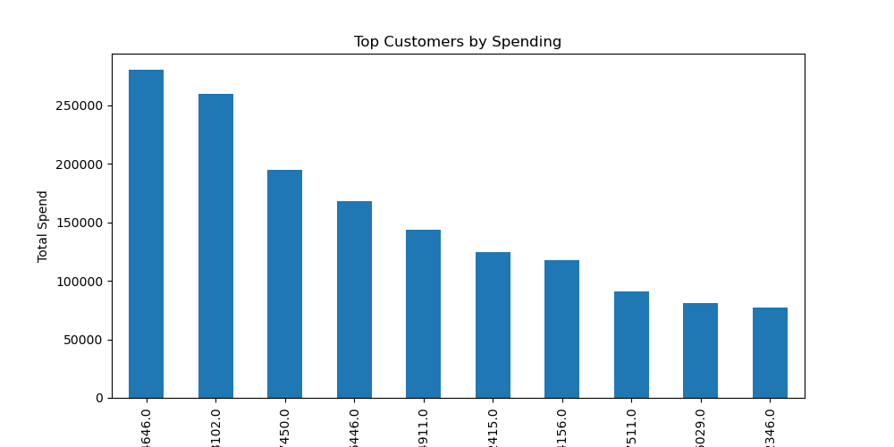
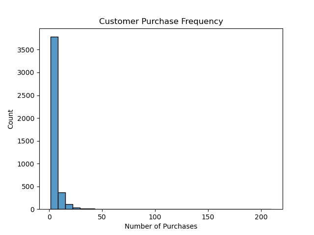
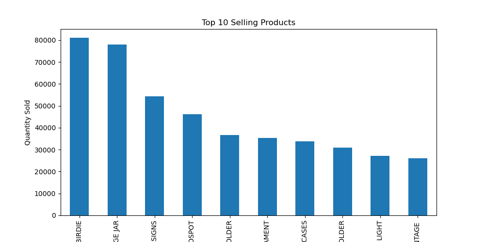

# E-commerce Purchase Analysis

## Dashboard Visualizations

### Country-wise Sales

### Purchase Frequency

### Top Products

## Project Overview
This project analyzes an e-commerce dataset to understand customer purchasing behavior and sales patterns.

## Dataset

The dataset used in this project is the **Online Retail Dataset**.

Download it here:
https://archive.ics.uci.edu/ml/datasets/online+retail

## Tools Used
- Python
- Pandas
- Matplotlib
- Seaborn
- Jupyter Notebook

## Project Steps
1. Data Loading
2. Data Cleaning
3. Feature Engineering
4. Exploratory Data Analysis
5. Data Visualization
6. Business Insights

## Key Insights
- Certain products dominate total sales.
- A small number of customers generate a large share of revenue.
- Most customers purchase only a few times.
- United Kingdom contributes the majority of sales.

## Visualizations
1) Top Selling Products

2) Customer Purchase Frequency

3) Country-wise Sales

## Dataset
Online Retail Dataset

## Author
Rachana Mishra
